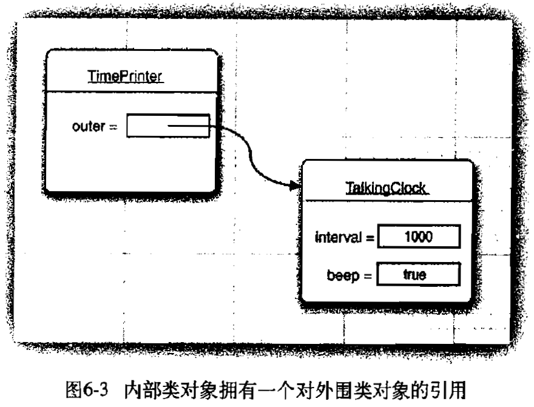

java内部类
========

** 内部类的优点 **
1. 内部类可以访问该类定义所在作用域中的数据，包括私有数据。
2. 内部类可以对同一个包中的其他类隐藏。
3. 当想要使用回调又不想写很多的代码，可以使用匿名内部类。

** 使用内部类访问对象状态 **

1. 一个例子

    ```java
    class TalkingClock {
        private int interval;
        private boolean beep;

        public TalkingClock(int interval, boolean beep) {
            this.interval = interval;
            this.beep = beep;
        }

        public class TimePrinter implements ActionListener {
            @Override
                public void actionPerformed(ActionEvent e) {
                    Date now = new Date();
                    // 使用了外部类的私有成员变量
                    if (beep) {
                        System.out.println("At the tone, the time is " + now);
                    }
                }
        }

        public void start() {
            ActionListener listener = new TimePrinter();
            Timer timer = new Timer(this.interval, listener);
            timer.start();
        }
    }

    public class Test1 {
        public static void main(String[] args) {
            TalkingClock clock = new TalkingClock(10, true);
            clock.start();
            //  new TalkingClock.TimePrinter();  // error
            // 生成TimePrinter对象的正确方法
            TimePrinter instance = clock.new TimePrinter();
        }
    }
    ```
2. 从上面的例子可以看出，内部类TimePrinter访问了外部类的beep私有成员变量。从传统意义上讲，一个方法可以引用调用这个方法的对象数据域。内部类既可以访问自身的数据域，以可以访问创建它的外围类对象的数据域。
3. **为了能够运行这个程序，内部类的对象总有一个隐式引用，它指向了创建它的外部类对象,这个引用在内部类的定义中是不可见的**。如下图所示:
<center></center>

** 局部内部类 **
1. 局部类不能使用private或者public来修饰，其作用域被限定在声明这个局部类的块中。
2. 局部类有一个优势，即对外部世界可以完全地隐藏起来。即只有定义该类的方法可以访问它。
3. 与其它内部类相比，局部类还有一个优点。它们不仅能够访问包含他们的外部类，还可以访问包含他们的外部类，还可以访问局部变量，不过，那些局部变量必须被声明为final。
4. final关键字可以应用于局部变量、实例变量和静态变量。在所有这些情况下，它们的含义都是：在创建这个变量之后，只能够为之赋值一次。此后，再也不能修改它的值了。这就是final。其赋值可以在代码块，构造函数，定义final变量的时候。

** 静态内部类 **
1. 有时候，使用内部类只是为了把一个隐藏在另外一个类的内部，**并不需要内部类引用外部类对象**，为此，可以将内部类声明为static,以便取消产生的引用。
2. 在接口中申明的类自动成为static和final。
