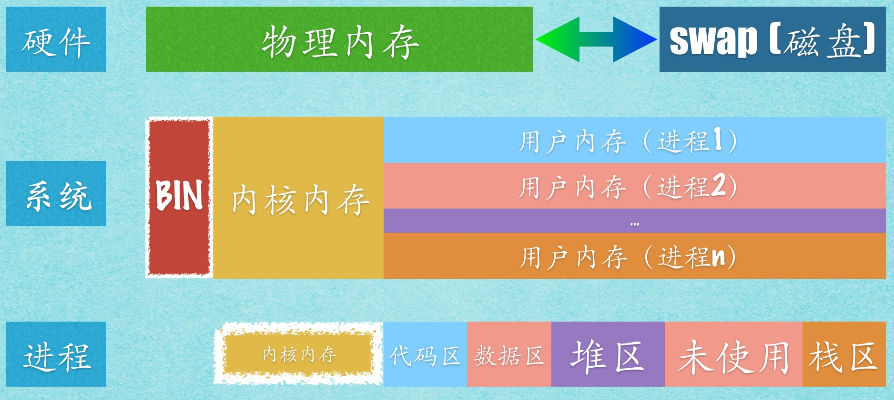

jvm heap
===========

[转自http://www.importnew.com/14486.html](http://www.importnew.com/14486.html)

**Linux进程内存模型**
1. JVM以一个进程(Process)的身份运行在Linux系统上，了解Linux与进程的内存关系，是理解JVM与Linux内存的关系基础
2. 下图给出了硬件、系统、进程三个层面的内存之间的概要关系。
    
3. 从硬件上看，Linux系统的内存空间由两个部分构成：物理内存和SWAP(位于磁盘)。物理内存是Linux活动时使用的主要内存区域；当物理内存不够使用时，Linux会把一部分暂时不用的内存数据放到磁盘上的swap中去，以便腾出更多的可用内存空间；而当需要使用位于swap的数据时，必须先将其换回到内存中。
4. 从Linux系统上看，除了引导系统的BIN区，整个内存空间主要被分成两部分：内核内存(Kernel space)、用户内存(User space)。内核内存是Linux自身使用的内存空间，主要提供给程序调度、内存分配、连接硬件资源等程序逻辑使用。用户内存是提供给各个进程主要空间，Linux给各个进程提供相同的虚拟内存空间；这使得进程之间相互独立，互不干扰。实现的方法是采用虚拟内存技术：给每个进程一定虚拟内存空间，而只有当虚拟内存实际被使用时，才分配物理内存。如下图所示，对于32的linux系统来说，一般将0~3G的虚拟内存空间分配作为用户空间，将3~4G的虚拟内存空间分配为内核空间；64位系统的划分情况类似。
    
5. 从进程的角度来看，进程能直接访问的用户内存（虚拟内存空间）被划分为5个部分：代码区、数据区、堆区、栈区、未使用区。代码区中存放应用程序的机器代码，运行过程中代码不能被修改，具有只读和固定大小的特点。数据区中存放了应用程序中的全局数据，静态数据和一些常量字符串等，其大小也是固定的。堆是运行时程序动态申请的空间，属于程序运行时直接申请、释放的内存资源。栈区用来存放函数的传入参数、临时变量，以及返回地址等数据。未使用区是分配新内存空间的预备区域。

**进程与JVM的内存关系**
1. JVM本质上是一个进程，因此其内存模型也有进程的一般特点。但是，JVM又不是一个普通的进程，其在内存模型上有许多赞新的特点，主要原因有两个：
    1. JVM将许多本来属于操作系统管理范畴的东西，移植到JVM内部，目的在于减少系统调用次数。‘
    2. Java NIO，目的在于减少读写IO的系统调用的开销。
2. JVM进程与普通内存模型比较如下图：
    

**Java堆内存**

