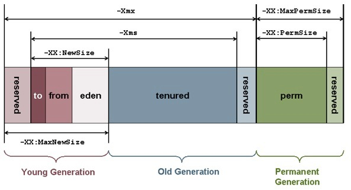

java内存模型
============

**jvm内存**

1. JVM内存=Java永久代 + Java堆(新生代+老年代) + 线程栈 + Java NIO

**java的内存**

1. Java中的堆是JVM所管理的最大的一块内存空间，主要用于存放各种类的实例对象。
2. 在Java中，堆被划分成两个不同的区域：新生代(Young)、老年代(Old)。新生代又被划分为三个区域：Eden、From Survivor、To Survivor。如下图:
    
3. java中的堆是gc收集垃圾的主要区域。gc分为两种：Minor GC, Full GC(或成为Major GC)。
4. Minor GC是发生在新生代中的垃圾收集动作，采用的是复制算法。
5. 新生代几乎是所有 Java 对象出生的地方，即 Java 对象申请的内存以及存放都是在这个地方。Java 中的大部分对象通常不需长久存活，具有朝生夕灭的性质。
6. 当一个对象被判定为 “死亡” 的时候，GC 就有责任来回收掉这部分对象的内存空间。新生代是 GC 收集垃圾的频繁区域。
7. 当对象在 Eden ( 包括一个 Survivor 区域，这里假设是 from 区域 ) 出生后，在经过一次 Minor GC 后，如果对象还存活，并且能够被另外一块 Survivor 区域所容纳( 上面已经假设为 from 区域，这里应为 to 区域，即 to 区域有足够的内存空间来存储 Eden 和 from 区域中存活的对象 )，则使用复制算法将这些仍然还存活的对象复制到另外一块 Survivor 区域 ( 即 to 区域 ) 中，然后清理所使用过的 Eden 以及 Survivor 区域 ( 即 from 区域 )，并且将这些对象的年龄设置为1，以后对象在 Survivor 区每熬过一次 Minor GC，就将对象的年龄 + 1，当对象的年龄达到某个值时 ( 默认是 15 岁，可以通过参数 -XX:MaxTenuringThreshold 来设定 )，这些对象就会成为老年代。但这也不是一定的，对于一些较大的对象 ( 即需要分配一块较大的连续内存空间 ) 则是直接进入到老年代。
8. Full GC 是发生在老年代的垃圾收集动作，所采用的是标记-清除算法。
9. 老年代里面的对象几乎个个都是在 Survivor 区域中熬过来的，它们是不会那么容易就 “死掉” 了的。因此，Full GC 发生的次数不会有 Minor GC 那么频繁，并且做一次 Full GC 要比进行一次 Minor GC 的时间更长。另外，标记-清除算法收集垃圾的时候会产生许多的内存碎片 ( 即不连续的内存空间 )，此后需要为较大的对象分配内存空间时，若无法找到足够的连续的内存空间，就会提前触发一次 GC 的收集动作。
