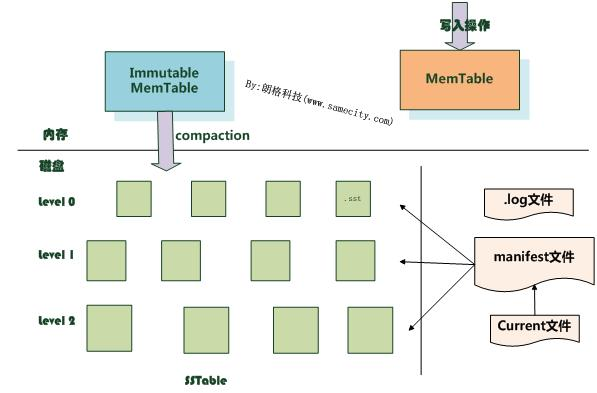

leveldb的整体架构
==========

1. LevelDb作为存储系统，数据记录的存储介质包括内存以及磁盘文件，如果像上面说的，当LevelDb运行了一段时间，此时我们给LevelDb进行透视拍照，那么您会看到如下一番景象：
    

2. Log文件和MemTable: 当应用写入一条Key:Value记录的时候，LevelDb会先往log文件里写入，成功后将记录插进Memtable中，这样基本就算完成了写入操作，因为一次写入操作只涉及一次磁盘顺序写和一次内存写入，所以这是为何说LevelDb写入速度极快的主要原因。Log文件在系统中的作用主要是用于系统崩溃恢复而不丢失数据.
3. Immutable MemTable: 当MemTable达到一定的大小之后，LevleDb会生成新的Log文件和Memtable，原先的Memtable就成为Immutable Memtable。顾名思义，Immutable MemTable表示该MemTable只读的。
4. SSTable文件：LevelDb以固定格式存储在磁盘上的文件就是SSTable文件。LevelDb后台调度会将Immutable Memtable的数据导出到磁盘，形成一个新的SSTable文件。SSTable就是由内存中的数据不断导出并进行Compaction操作后形成的，而且SSTable的所有文件是一种层级结构，第一层为Level 0，第二层为Level 1，依次类推，层级逐渐增高，这也是为何称之为LevelDb的原因。
5. SSTable中的文件是Key有序的，就是说在文件中小key记录排在大Key记录之前，各个Level的SSTable都是如此，但是这里需要注意的一点是：Level 0的SSTable文件（后缀为.sst）和其它Level的文件相比有特殊性：这个层级内的.sst文件，两个文件可能存在key重叠，比如有两个level 0的sst文件，文件A和文件B，文件A的key范围是：{bar, car}，文件B的Key范围是{blue,samecity}，那么很可能两个文件都存在key=”blood”的记录。对于其它Level的SSTable文件来说，则不会出现同一层级内.sst文件的key重叠现象，就是说Level L中任意两个.sst文件，那么可以保证它们的key值是不会重叠的。这点需要特别注意，后面您会看到很多操作的差异都是由于这个原因造成的。
6. Manifest:记载了SSTable各个文件的管理信息，比如属于哪个Level，文件名称叫啥，最小key和最大key各自是多少。
7. Current文件是干什么的呢？这个文件的内容只有一个信息，就是记载当前的manifest文件名。因为在LevleDb的运行过程中，随着Compaction的进行，SSTable文件会发生变化，会有新的文件产生，老的文件被废弃，Manifest也会跟着反映这种变化，此时往往会新生成Manifest文件来记载这种变化，而Current则用来指出哪个Manifest文件才是我们关心的那个Manifest文件。
